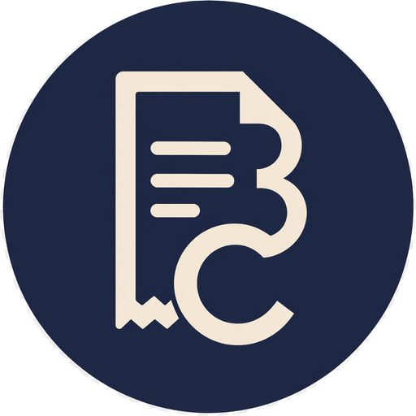
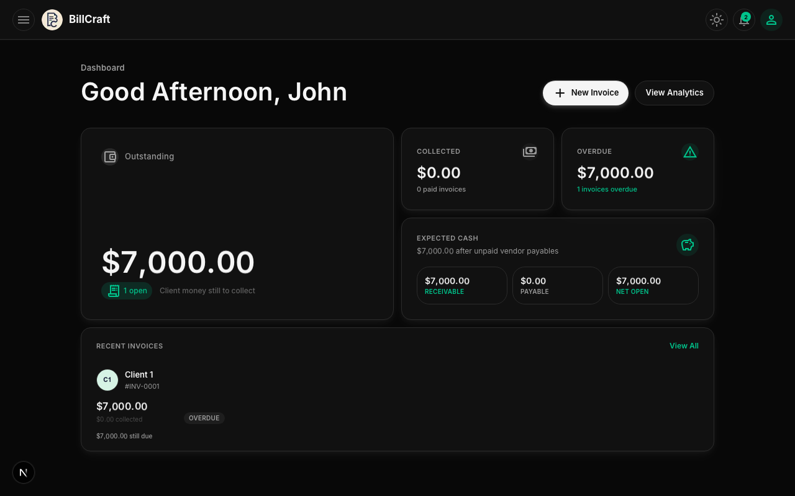
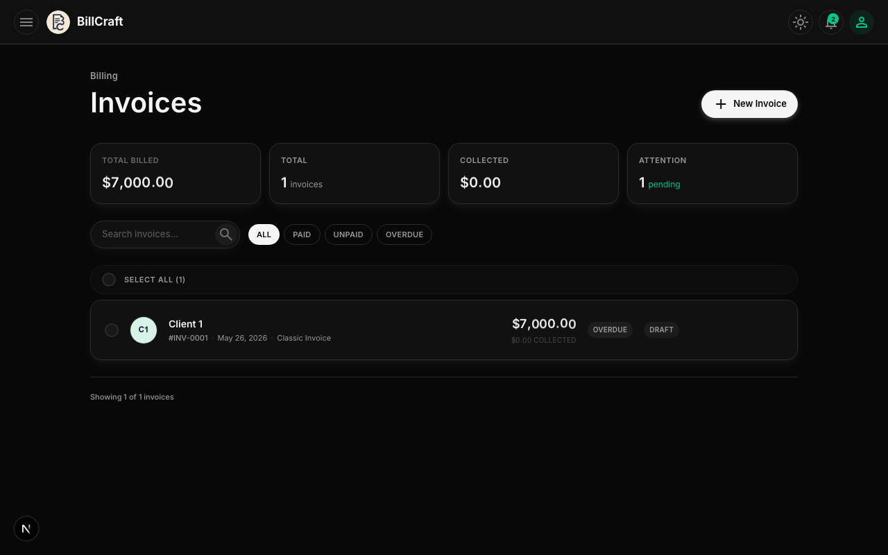
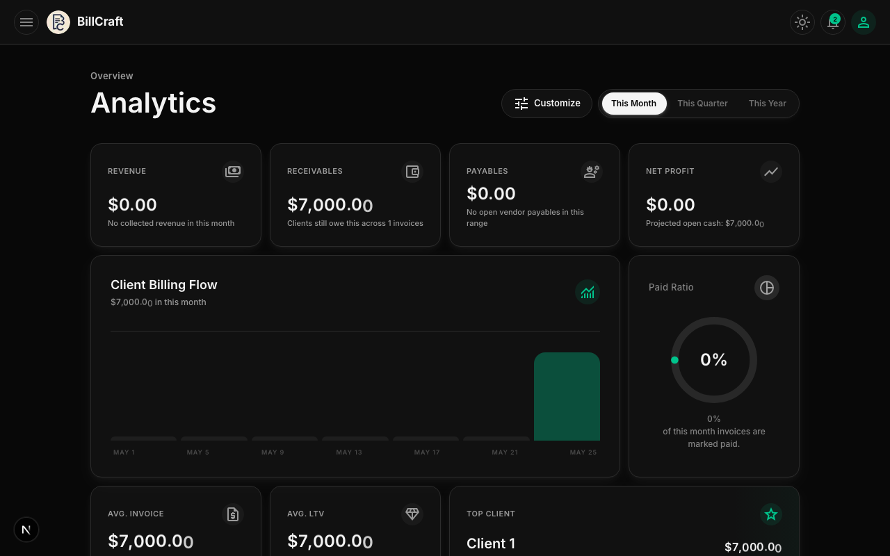
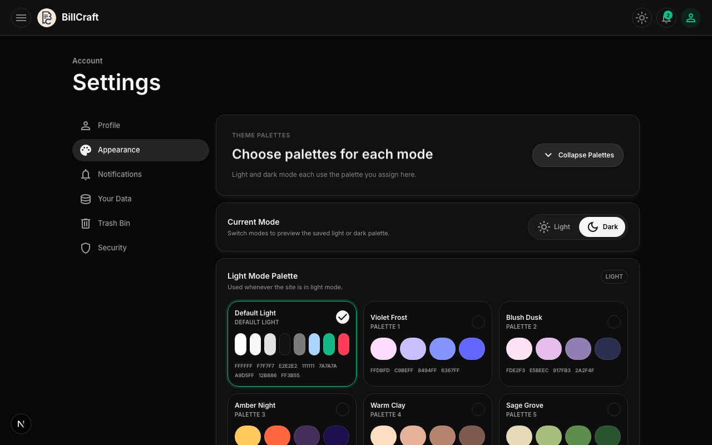
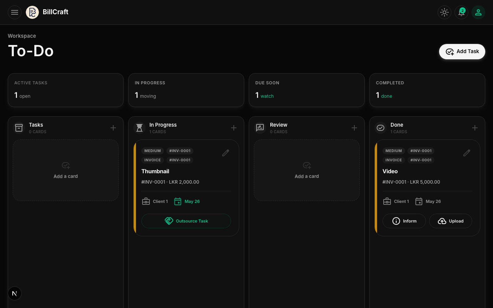

# BillCraft

<p align="center">
  
</p>

<p align="center">
  
  
  
  
  
</p>

### Premium invoice management for freelancers and growing small businesses.

BillCraft is a polished, local-first invoicing dashboard built for freelancers, consultants, and small businesses that need one workspace for invoices, clients, outsourced work, revenue analytics, and billing tasks.

It is built with **Next.js App Router**, **React**, **TypeScript**, **Tailwind CSS**, and a lightweight local JSON data layer.

---

## What is BillCraft?

BillCraft helps freelancers, consultants, and early-stage small businesses run the everyday billing loop without jumping between spreadsheets, notes, and separate invoice trackers.

The app keeps each user's workspace in local profile folders, so invoices, clients, vendors, uploaded assets, security metadata, analytics preferences, and tasks stay on the machine by default. From the dashboard you can see paid revenue, pending totals, overdue invoices, recent clients, and payment health at a glance.

---

# Core Features

## Dashboard for payment health

Track collected revenue, pending invoices, overdue totals, paid ratios, and recent invoice activity from a compact dashboard.

<p align="center">
  
</p>

## Invoice creation and tracking

Create, edit, view, filter, search, and export invoices. BillCraft supports line items, due dates, paid/unpaid/overdue status, reusable clients, and one-time client entries.

<p align="center">
  
</p>

## Revenue analytics

Review revenue flow, paid ratio, average invoice value, average client value, top client performance, revenue trends, invoice aging, status mix, and collection health across monthly, quarterly, and yearly ranges. Analytics widgets can be shown, hidden, reordered, and saved per profile.

<p align="center">
  
</p>

## Theme & Typography Customization

Switch between light and dark modes, choose separate palettes for each mode, and collapse the color selectors to keep settings tidy. BillCraft features an advanced **Typography Settings** engine allowing you to switch typefaces across the platform (Inter, Open Sans, Google Sans Flex, Outfit, or Plus Jakarta Sans) to customize your workspace style.

<p align="center">
  
</p>

## Redesigned Kanban Tasks

Plan invoice work with a local to-do board. Cards have been completely redesigned for a premium look with custom interactive hover states, full-width "Outsource Task" action controls, dual-action completed flows (Inform/Upload grid), estimates, and custom tags.

<p align="center">
  
</p>

## Bulk Invoice Actions

Select multiple invoices at once using circular checkboxes and trigger bulk operations via a premium glassmorphic bottom actions bar. Supports staggered multi-PDF downloads to bypass browser popup block warnings, bulk status transitions, and bulk deletions with instant synchronization.

## Fluid Page-Specific Skeletons

To deliver an instantaneous, high-fidelity experience, BillCraft implements custom, native route-specific skeleton loading screens for all major views. Layout shifts are eliminated, and tab transitions feel smooth and responsive.

---

## All Features

### Profiles, Security, and Local Data

- Create and switch between up to 5 local billing profiles
- Store profile identity, business name, email, phone, avatar, and signature
- Require a profile password during profile creation
- Unlock password-protected profiles and log out of active protected sessions
- Add and update password hints
- Change profile passwords from settings
- Keep each profile's data in its own local folder
- Save uploaded profile/client/vendor assets locally
- Store password hashes and salts in each profile's local `security.json`
- Keep `User data/` out of git by default

### Invoices

- Create invoices with itemized work
- Edit existing invoices
- View invoice details in a modal
- Track paid, unpaid, and overdue status
- Search invoices by client, invoice ID, or email
- Filter invoices by status
- Use saved clients or one-time client contacts
- Save new clients as regular clients or one-time invoice contacts
- Upload client avatars while creating invoice contacts
- Preview invoice profile, client details, line items, and totals before export
- Export invoices as `.pdf` files
- **Bulk actions bar** (with circular selection checkboxes and a glassmorphic quick-action menu):
  - Intelligent staggered multi-PDF exports (avoiding browser pop-up blocks)
  - Bulk status updates (Paid, Unpaid, Overdue)
  - Bulk invoice deletions with instant local synchronization

### Clients

- Add and edit client records
- Upload client avatars
- Search clients by name, email, or company
- See total billed, invoice count, and status breakdown per client
- Expand client cards for deeper invoice context

### Analytics

- Revenue flow chart
- Paid invoice ratio
- Average invoice value
- Average client value
- Top client summary
- Revenue trend chart for paid and open revenue
- Status mix chart for paid, unpaid, and overdue totals
- Top clients chart
- Invoice aging chart
- Collection gauge
- Time ranges for this month, this quarter, and this year
- Show, hide, reorder, reset, and save analytics widgets per profile

### Outsourcing

- Track vendor-facing payable invoices
- Add reusable vendors or one-time vendor contacts
- Save and update vendor records
- Upload vendor avatars
- Search and filter outsourcing invoices
- Track paid, unpaid, and overdue vendor payments
- Preview payable details, line items, and totals
- Export outsourcing invoices as `.txt` files

### To-Do Board

- Drag tasks between Backlog, In Progress, Review, and Done
- Add and edit tasks
- Delete tasks
- Set priority, due date, estimate, tags, and client/vendor context
- Persist task order per profile
- **Redesigned premium kanban tiles** with modern borders, transition effects, and larger typographic scales
- **Full-width outsource button** with premium styling and micro-interaction scale feedback
- **Crisp dual column footer action controls** (Inform/Upload) for completed tasks

### Settings, Appearance, and Data Export

- Update profile details
- Choose currency
- Toggle light and dark modes
- Configure toast notification position
- Toggle invoice reminder notification preference
- Export profile data as JSON
- Export profile data as CSV
- Require profile password confirmation before export when a profile is password-protected
- Delete the current profile or all local profiles from settings
- **Collapse & Expand theme palettes** to keep color customization dashboard tidy
- **Premium Font Selector engine** allowing users to choose their typeface across the platform, dynamically supporting *Inter*, *Open Sans*, *Google Sans Flex*, *Outfit*, and *Plus Jakarta Sans*

### Premium UX & Fluid Animations

- **Circular Reveal Transitions**: Immersive clip-path reveal animations when toggling between light and dark themes
- **Page-Specific Route Skeletons**: Dedicated, custom React loading skeleton fallbacks for the Dashboard, Invoices, Clients, Outsourcing, To-Do, and Settings segments to eliminate page layout shifts
- **Glassmorphic Floating Components**: Premium blurred background action bars, modals, and drop-ups styled with curated micro-animations

---

# Tech Stack

| Area | Technology |
| --- | --- |
| Framework | Next.js 16 App Router |
| UI | React 19 |
| Language | TypeScript |
| Styling | Tailwind CSS 4 and CSS custom properties |
| Theme | next-themes |
| Charts | Recharts with local EvilCharts wrappers |
| Animation | Motion |
| UI utilities | Base UI, lucide-react, shadcn, class-variance-authority, tailwind-merge |
| Toasts | Sileo |
| Cross-Platform | cross-env for seamless multi-platform development environment setup |
| Data | Local JSON files through Next.js API routes |
| Persistence | `User data/` profile folders |
| Assets | Local profile asset storage served through `/api/user-data/asset` |

---

# Installation

## Prerequisites

- Node.js 20+
- npm

## Run locally

```bash
git clone https://github.com/NippaGG/Billcraft-invoice-manager.git
cd Billcraft-invoice-manager
npm install
npm run dev
```

Open [http://localhost:3000](http://localhost:3000) in your browser.

---

# Project Structure

```text
src/
  app/
    api/user-data/      Local JSON data endpoint
    api/user-data/asset/  Local profile asset endpoint
    analytics/          Revenue analytics page
    clients/            Client management page
    invoices/           Invoice management page
    outsourcing/        Vendor/payable invoice page
    settings/           Profile, appearance, and preference settings
    todo/               Billing task board
  components/           Shared layout, theme, toast, and UI helpers
  data/                 Invoice, client, vendor, and todo data types/helpers
  hooks/                Local data, currency, theme, toast, and outsourcing hooks
  lib/                  Toast utilities and local data store
public/
  screenshots/          README screenshots
  billcraft-*.png       Brand assets
User data/              Local runtime data, gitignored
```

---

# Available Scripts

```bash
npm run dev      # Start the Next.js development server
npm run build    # Create a production build
npm run start    # Start the production server
npm run lint     # Run ESLint
```

---

# Local Data Model

```text
User data/
  profiles.json
  <profile-id>/
    profile.json
    security.json
    clients.json
    invoices.json
    vendors.json
    outsourcing-invoices.json
    todo-tasks.json
    assets/
```

This directory is intentionally ignored by git so real client, invoice, and profile details do not get committed.

Profile passwords are not stored as plain text. BillCraft stores a password hash, salt, optional hint, and password change timestamp in `security.json`.
