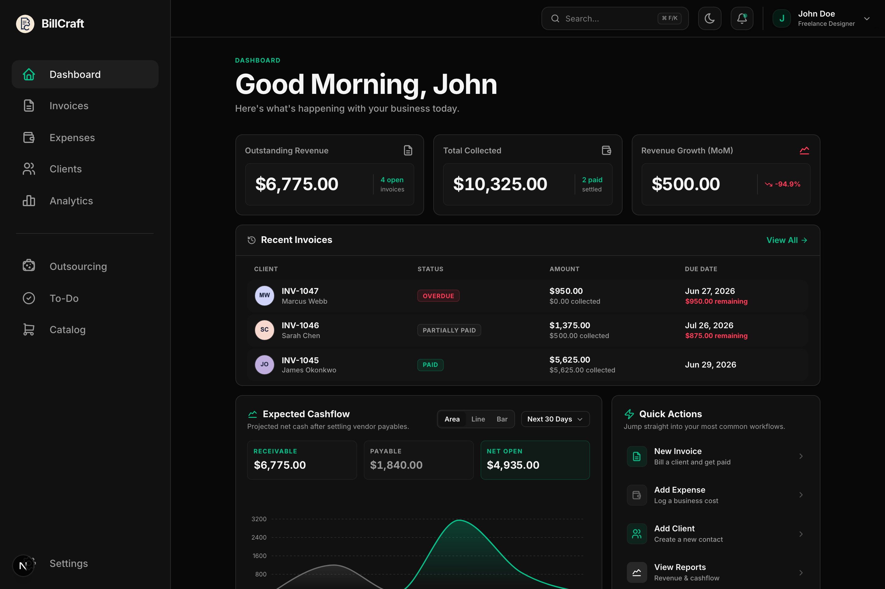
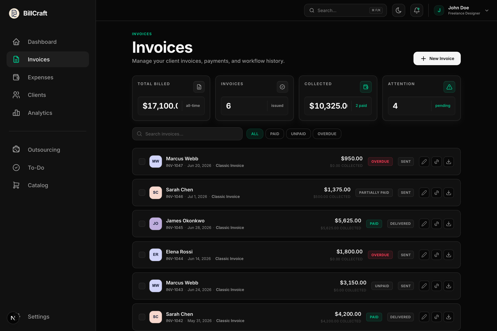
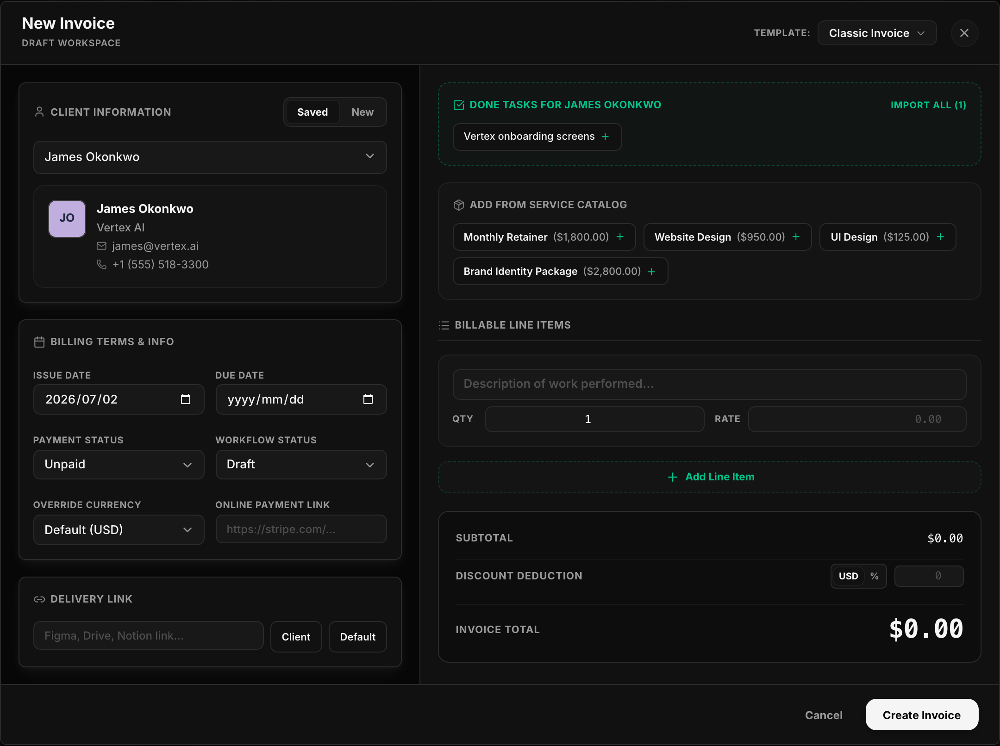
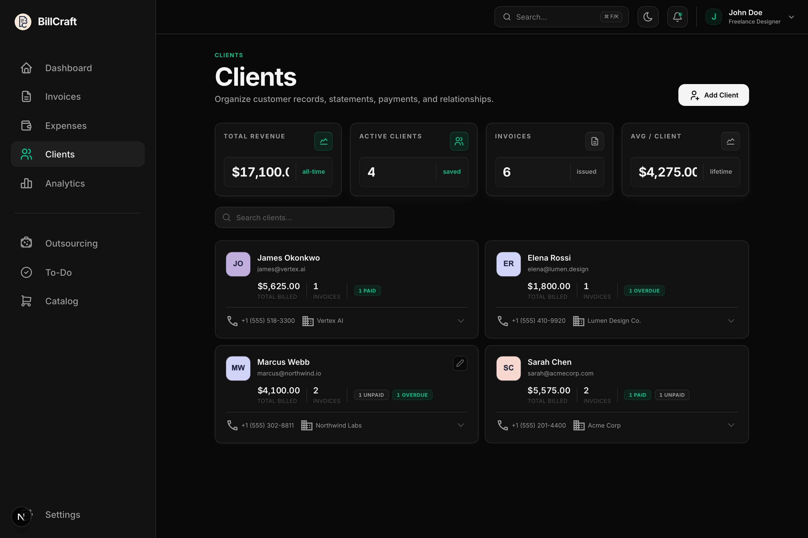
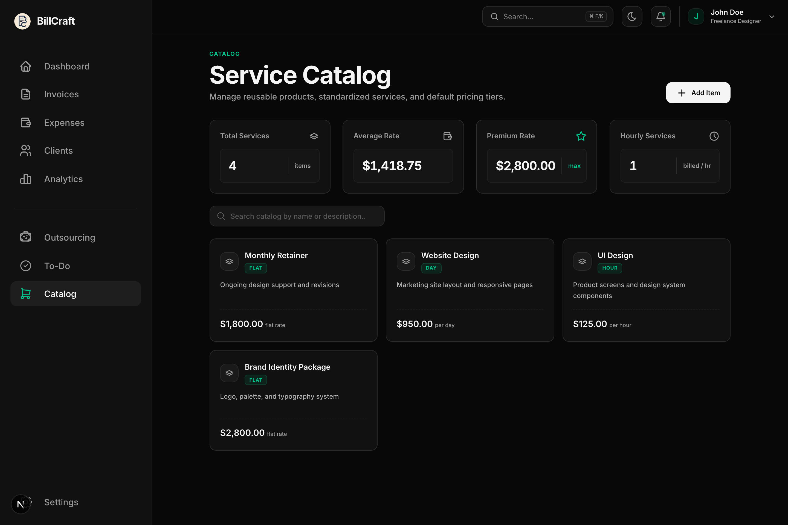
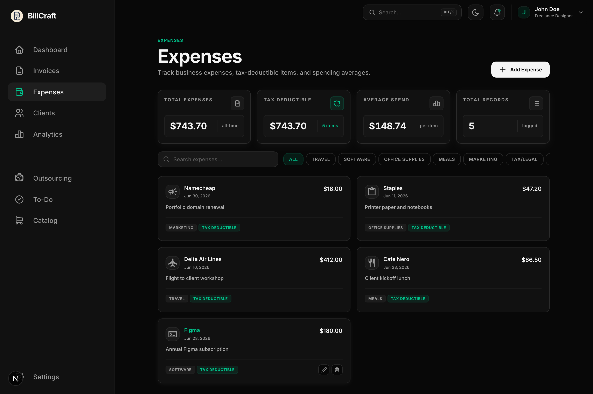
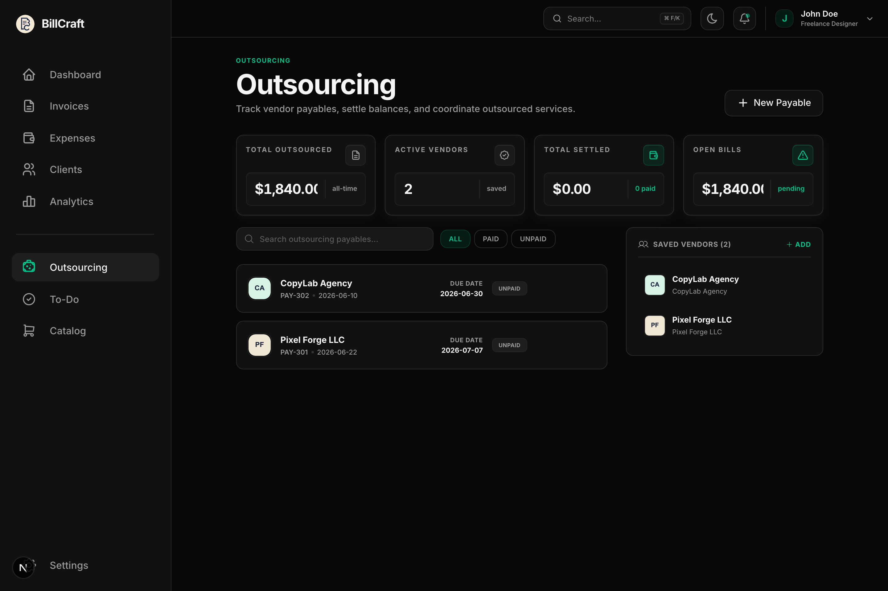
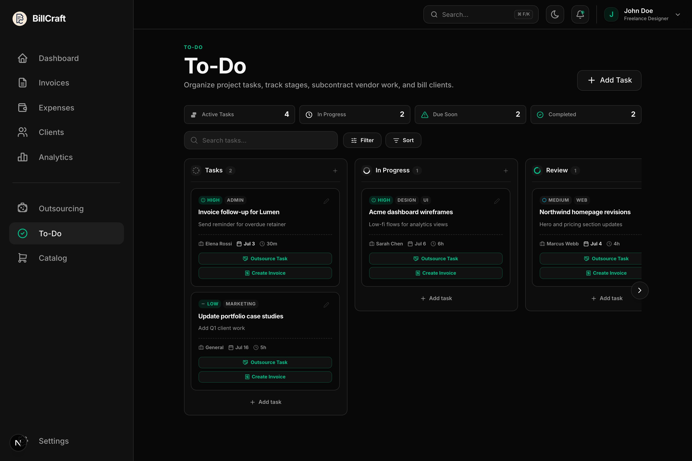
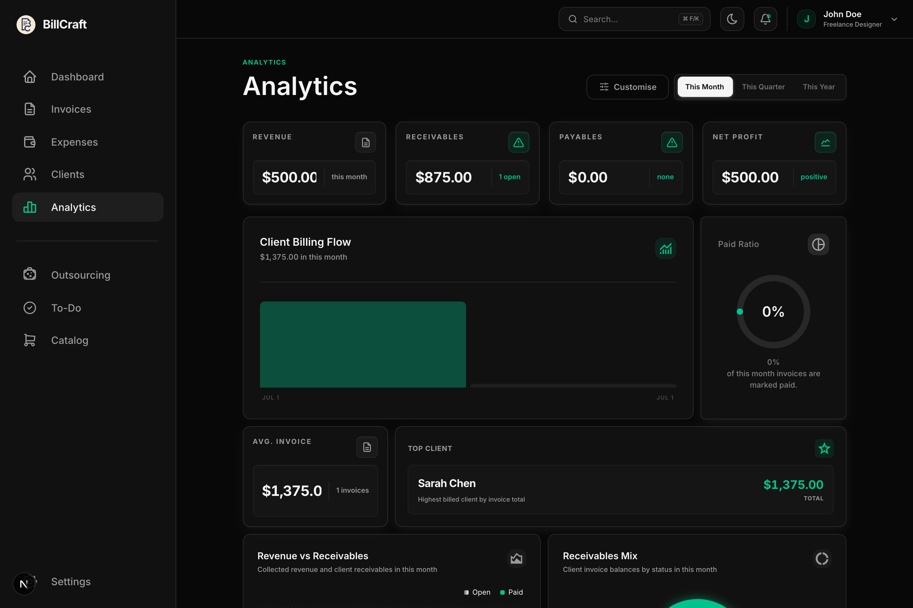
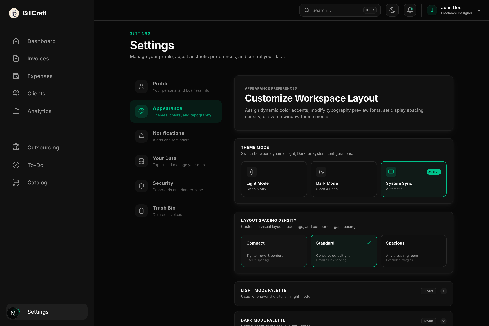

[](https://github.com/nipunyatawara-dev/Billcraft-invoice-manager)

<p align="center">
  
  &nbsp;
  
  &nbsp;
  
  &nbsp;
  
  &nbsp;
  
</p>

<p align="center">
  <a href="https://github.com/nipunyatawara-dev/Billcraft-invoice-manager"></a>
</p>

----

### Get started:

* [Run locally](#run-locally) — clone, install, and open in your browser
* [Seed demo data](#seed-demo-data) — populate a sample profile for screenshots or testing
* [Local data & profiles](#local-data--profiles) — where your invoices live on disk
* [Contributing](#contributing) — pull requests welcome

<br/>

----

[**BillCraft**](https://github.com/nipunyatawara-dev/Billcraft-invoice-manager) is a local-first invoicing workspace for freelancers, consultants, and small businesses.

* Dashboard analytics for revenue, overdue totals, and billing activity
* Invoice creation, tracking, PDF export, and bulk actions
* Client, vendor, expense, and catalog management in one place
* Kanban task board with task-to-invoice import
* Payment tracking with simulated Stripe checkout and email reminders
* Up to 5 password-protected billing profiles
* Light/dark themes, color palettes, typography, and layout density controls

# Contents <!-- omit in toc -->

- [What BillCraft is and isn't](#what-billcraft-is-and-isnt)
- [Dashboard](#dashboard)
- [Invoices](#invoices)
- [Clients & catalog](#clients--catalog)
- [Expenses & outsourcing](#expenses--outsourcing)
- [Task board](#task-board)
- [Analytics & notifications](#analytics--notifications)
- [Appearance & customization](#appearance--customization)
- [Local data & profiles](#local-data--profiles)
- [Run locally](#run-locally)
- [Seed demo data](#seed-demo-data)
- [Tech stack](#tech-stack)
- [Contributing](#contributing)

<a name="about"></a>

# What BillCraft is and isn't

* **BillCraft is** a self-hosted invoicing dashboard that keeps your billing data on your machine — invoices, clients, expenses, tasks, and analytics in a single Next.js app

* **BillCraft is not** a cloud SaaS or accounting platform. There is no hosted backend, multi-user sync, or built-in tax filing — your data stays in local JSON files under `User data/`

<a name="dashboard"></a>

# Dashboard


* Outstanding revenue, total collected, and month-over-month growth at a glance
* Recent invoices with paid, partially paid, and overdue states
* Expected cashflow chart with receivable vs payable breakdown
* Quick actions to create invoices, log expenses, and add clients
* Command palette (`⌘K`) for fast navigation across the app

<a name="invoices"></a>

# Invoices





* Create and edit itemized invoices with due dates and status tracking (paid, unpaid, overdue)
* Search, filter, and bulk-update invoice statuses
* Export single or multiple invoices as PDF
* Track partial payments and installments with attachments
* Import completed Kanban tasks as line items from the service catalog
* Simulated Stripe checkout flows for testing payment collection
* Share invoices via WhatsApp and other channels

<a name="clients"></a>

# Clients & catalog





* Manage client profiles with contact details, avatars, and notes
* Reusable or one-time client entries on invoices
* Product and service catalog with default pricing units (hourly, daily, flat rate, unit price)
* Pull catalog items straight into new invoices

<a name="expenses"></a>

# Expenses & outsourcing





* Log business expenses by category (travel, software, office supplies, and more)
* Mark expenses as tax-deductible and filter by category
* Track subcontractor vendors and payable invoices
* Export vendor payables as PDF

<a name="todo"></a>

# Task board



* Drag-and-drop Kanban board with stages, priorities, and tags
* Time estimates on tasks for billing accuracy
* One-click import of completed tasks into invoice line items
* Outsource tasks and create invoices directly from cards
* Notification hooks for email, SMS, and WhatsApp reminders (simulated)

<a name="analytics"></a>

# Analytics & notifications



* Revenue, receivables, payables, and net profit widgets
* Client billing flow, paid ratio, and revenue trend charts
* Customisable analytics layout with month, quarter, and year ranges
* Billing alerts for overdue and upcoming invoices
* Configurable reminder schedules in Settings
* SMTP email reminder simulator for testing follow-ups

<a name="appearance"></a>

# Appearance & customization



* Light, dark, and system theme modes
* Separate color palettes for light and dark mode
* System-wide typeface selection (Inter, Open Sans, Google Sans Flex, Outfit, Plus Jakarta Sans)
* Corner style toggle: Rounded or Squircle (macOS-like)
* Layout density controls (compact, standard, spacious)

<a name="local"></a>

# Local data & profiles

BillCraft stores everything locally in the `User data/` directory next to your project.

* Up to **5 password-protected billing profiles**, each with its own clients, invoices, and settings
* Profile avatars, signatures, and business details saved on disk
* JSON files accessed through Next.js API routes — no external database required
* Export and backup from **Settings → Your Data**
* Deleted invoices recoverable from **Settings → Trash Bin**

Profile folders are created automatically on first run. Keep `User data/` out of version control — it is listed in `.gitignore`.

<a name="install"></a>

# Run locally

### Prerequisites

* Node.js 20+
* npm

### Steps

1. Clone the repository:

   ```bash
   git clone https://github.com/nipunyatawara-dev/Billcraft-invoice-manager.git
   cd Billcraft-invoice-manager
   ```

2. Install dependencies:

   ```bash
   npm install
   ```

3. Start the development server:

   ```bash
   npm run dev
   ```

4. Open [http://localhost:3000](http://localhost:3000) in your browser.

### Production build

```bash
npm run build
npm start
```

<a name="seed"></a>

# Seed demo data

With the dev server running, you can populate a sample **John Doe** profile (password: `111111`) with clients, invoices, expenses, tasks, vendors, and catalog items:

```bash
node scripts/seed-john-doe.mjs
```

To refresh README screenshots after seeding:

```bash
npx playwright install chromium
node scripts/capture-readme-screenshots.mjs
```

<a name="stack"></a>

# Tech stack

| Layer | Technology |
| --- | --- |
| **Framework** | Next.js 16 (App Router) |
| **UI** | React 19, Tailwind CSS v4, shadcn/ui, Lucide |
| **Charts** | Recharts |
| **Motion** | Motion |
| **PDF** | pdf-lib |
| **Theming** | next-themes, CSS variables |
| **Storage** | Local JSON via API routes (`User data/`) |

<a name="contributing"></a>

# Contributing

Pull requests and issue reports are welcome.

1. Fork the repo and create a feature branch
2. Make your changes and run `npm run lint`
3. Open a pull request with a clear description of what changed and why

---

<p align="center">
  
</p>
