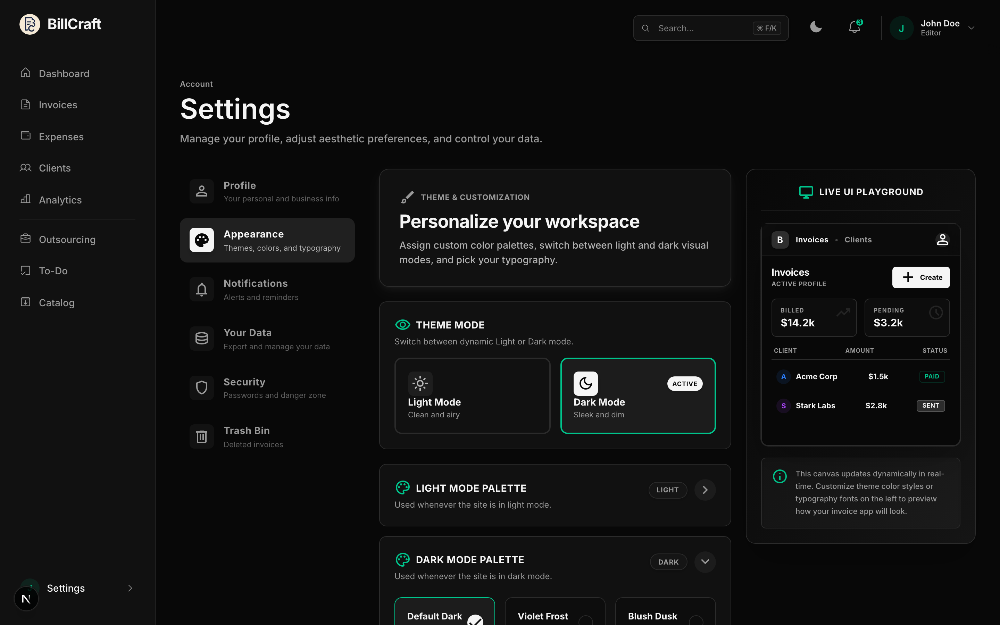

# BillCraft

<p align="center">
  
</p>

<p align="center">
  
  
  
  
  
</p>

### Premium invoice management for freelancers and growing small businesses.

BillCraft is a polished, local-first invoicing dashboard built for freelancers, consultants, and small businesses that need one workspace for invoices, clients, outsourced work, revenue analytics, and billing tasks.

It is built with **Next.js App Router**, **React 19**, **TypeScript**, **Tailwind CSS v4**, and a lightweight local JSON data layer.

---

## What is BillCraft?

BillCraft helps freelancers, consultants, and early-stage small businesses run the everyday billing loop without jumping between spreadsheets, notes, and separate invoice trackers.

The app keeps each user's workspace in local profile folders, so invoices, clients, vendors, uploaded assets, security metadata, analytics preferences, and tasks stay on the machine by default. From the dashboard you can see paid revenue, pending totals, overdue invoices, recent clients, and payment health at a glance.

---

# Core Features

## Dashboard for payment health

Track collected revenue, pending invoices, overdue totals, paid ratios, and recent invoice activity from a compact dashboard.

<p align="center">
  
</p>

## Invoice creation and tracking

Create, edit, view, filter, search, and export invoices. BillCraft supports line items, due dates, paid/unpaid/overdue status, reusable clients, and one-time client entries.

<p align="center">
  
</p>


## Theme & Typography Customization

Switch between light and dark modes, choose separate palettes for each mode, and collapse the color selectors to keep settings tidy. 

BillCraft features an advanced **Typography Settings** engine allowing you to switch typefaces across the platform (Inter, Open Sans, Google Sans Flex, Outfit, or Plus Jakarta Sans) to customize your workspace style. You can also toggle the global **Corner Style** between classic "Rounded" and modern macOS like "Squircle".

<p align="center">
  
</p>

## All Features

- **Profiles & Local Data**: Up to 5 password-protected billing profiles. All profile identity, configuration, phone, email, signature, and avatars remain stored locally in private folders under `User data/`.
- **Invoices**: Create, edit, view, search, filter, and export itemized invoices as `.pdf`.
- **Payment Tracking & Simulators**: Track partial payments/installments with details like amount, date, method, receipt files (base64 image/PDF uploads), and overall payment notes. Simulators in the UI process Stripe Checkout sandboxes (card checks, webhook events, auto-paid updates) and compile SMTP Email Reminders with log output.
- **Task-to-Invoice Automation**: Import done tasks from the To-Do board directly into invoice line items. Estimate durations (e.g. "2h 45m") auto-convert to billable hours based on profile rates, tagging tasks as "Billed" to avoid double-charging.
- **Bulk Actions**: Glassmorphic bottom actions bar for staggered multi-PDF downloads (avoiding browser pop-up blocks), bulk status transitions, and bulk invoice deletions.
- **Clients & Outsourcing**: Manage clients (breakdown stats, total billed, invoices) and subcontractors (vendors list, vendor payable logs, vendor invoice exports as `.pdf`).
- **Service Catalog**: Register reusable services and products with default pricing, units (hourly, daily, flat, unit), and descriptions.
- **Expense & Tax Logging**: Track vendor-facing expenses across categories (Travel, Software, office supplies, etc.) and toggle tax-deductible switches.
- **Redesigned To-Do Board**: Drag-and-drop Kanban tiles (estimate, priority, tags) with a top drag-to-delete Trash zone, countdown Undo pill, Done notification controls (Email, WhatsApp, SMS), and vendor outsourcing payable automation.
- **Settings, Appearance & Fonts**: Switch toast positions, toggle auto-reminders, export data to JSON/CSV, collapse theme color palettes, dynamically change system-wide typefaces (Inter, Open Sans, Google Sans Flex, Outfit, Plus Jakarta Sans), toggle Squircle/Rounded corners, and manage the Trash Bin settings tab.
- **Premium UX & Animations**: Immersive circular theme-switch reveals, custom route skeletons, and premium glassmorphic modals/bars powered by Motion.

---

# Tech Stack

| Area | Technology |
| --- | --- |
| Framework | Next.js 15 App Router |
| UI | React 19 |
| Language | TypeScript |
| Styling | Tailwind CSS v4 and CSS custom properties |
| Theme | next-themes |
| Charts | Recharts with local EvilCharts wrappers |
| Animation | Motion |
| UI utilities | Base UI, lucide-react, shadcn, class-variance-authority, tailwind-merge |
| Toasts | Sileo |
| Cross-Platform | cross-env for seamless multi-platform development environment setup |
| Data | Local JSON files through Next.js API routes |
| Persistence | `User data/` profile folders |
| Assets | Local profile asset storage served through `/api/user-data/asset` |

---

# Installation

## Prerequisites

- Node.js 20+
- npm

## Run locally

```bash
git clone https://github.com/NippaGG/Billcraft-invoice-manager.git
cd Billcraft-invoice-manager
npm install
npm run dev
```

Open [http://localhost:3000](http://localhost:3000) in your browser.
